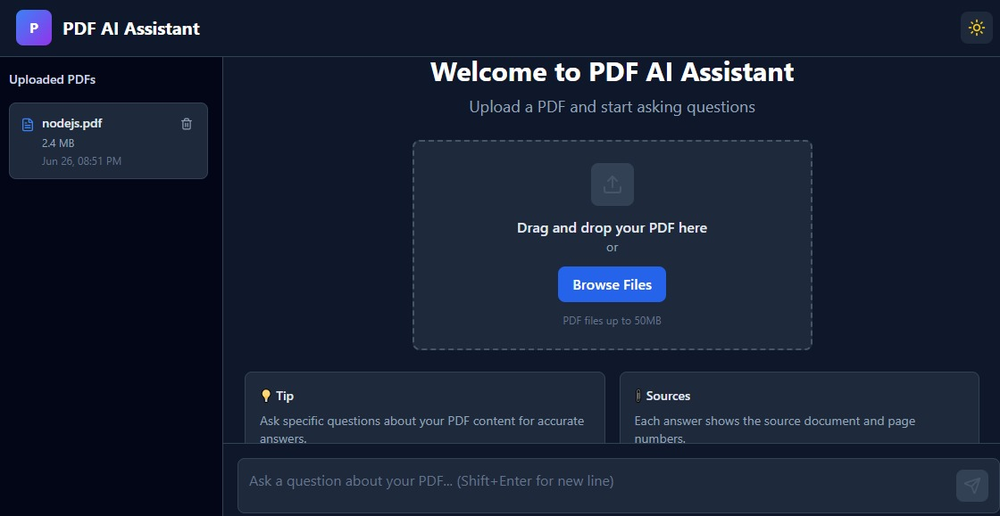
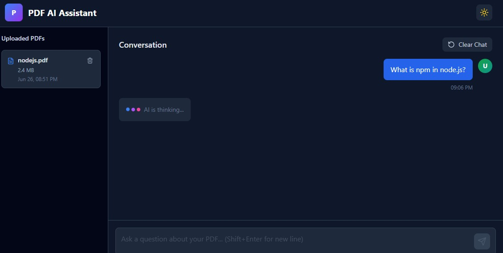
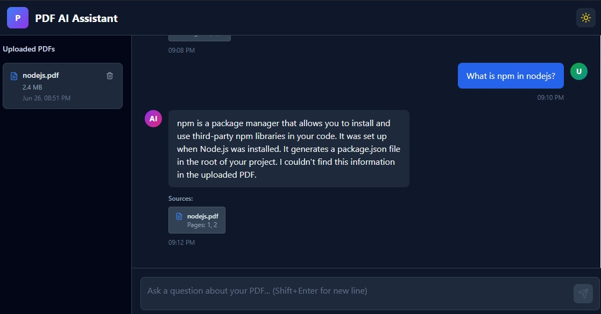

# 📄 PDF AI Assistant

A full-stack **Retrieval-Augmented Generation (RAG)** application that enables users to upload PDF documents and ask natural language questions about their content. The system extracts text from PDFs, generates embeddings, stores them in a vector database, retrieves the most relevant context, and uses an LLM to generate accurate, context-aware responses with source citations.

---

## ✨ Features

* 📄 Upload PDF documents
* 💬 ChatGPT-style conversational interface
* 🧠 Retrieval-Augmented Generation (RAG)
* 🔍 Semantic search using vector embeddings
* 📚 Source citations with page numbers
* 🤖 AI-powered question answering
* 🌙 Dark & Light mode
* 📱 Fully responsive UI
* ⚡ Fast FastAPI backend
* 🎯 Drag-and-drop PDF upload
* 🔄 Loading states and toast notifications

---

# 🏗️ Architecture

```
                 +----------------------+
                 |      React Frontend  |
                 +----------+-----------+
                            |
                     Upload PDF / Ask Question
                            |
                            ▼
                 +----------------------+
                 |      FastAPI API     |
                 +----------+-----------+
                            |
            +---------------+----------------+
            |                                |
            ▼                                ▼
    PDF Processing                  User Question
            |                                |
            ▼                                ▼
      PyPDFLoader                 Vector Similarity Search
            |                                |
            ▼                                ▼
RecursiveCharacterTextSplitter       Qdrant Vector DB
            |                                ▲
            ▼                                |
      Generate Embeddings -------------------+
            |
            ▼
         Store Chunks
            |
            ▼
      Relevant Context
            |
            ▼
        LLM (Ollama/OpenAI)
            |
            ▼
 Answer + Source Citations
```

---

# 🛠️ Tech Stack

## Frontend

* React 19
* TypeScript
* Vite
* Tailwind CSS
* Zustand
* Axios
* Lucide React
* React Hot Toast

## Backend

* FastAPI
* Python
* LangChain
* PyPDFLoader
* RecursiveCharacterTextSplitter
* Qdrant Vector Database

## AI & RAG

* OpenAI Embeddings / Ollama Embeddings
* Qdrant
* Semantic Search
* Retrieval-Augmented Generation (RAG)
* Large Language Models (LLMs)

---


# ⚙️ How It Works

### 1. Upload PDF

The user uploads a PDF document from the frontend.

### 2. PDF Processing

The backend extracts text using **PyPDFLoader**.

### 3. Text Chunking

The extracted text is divided into overlapping chunks using **RecursiveCharacterTextSplitter**.

### 4. Embedding Generation

Each chunk is converted into a vector embedding.

### 5. Vector Storage

The embeddings are stored in **Qdrant**.

### 6. Ask a Question

The user submits a natural language query.

### 7. Retrieval

Relevant chunks are retrieved using vector similarity search.

### 8. Response Generation

The retrieved context is passed to the LLM.

### 9. Final Answer

The model returns an answer along with the source pages used.

---

# 🚀 Installation

## Clone the Repository

```bash
git clone <repository-url>
cd pdf-ai-assistant
```

---

## Backend Setup

```bash
cd backend

python -m venv venv

# Windows
venv\Scripts\activate

# Linux/macOS
source venv/bin/activate

pip install -r requirements
```

### Start Qdrant

Using Docker:

```bash
docker run -p 6333:6333 qdrant/qdrant
```

### Configure Environment Variables

Create a `.env` file inside the backend directory.

Example:

```env
OPENAI_API_KEY=your_api_key

# or

OLLAMA_BASE_URL=http://localhost:11434
OLLAMA_MODEL=gemma3:4b
```

### Run Backend

```bash
uvicorn main:app --reload
```

Backend runs at

```
http://localhost:8000
```

---

## Frontend Setup

```bash
cd frontend

npm install

npm run dev
```

Frontend runs at

```
http://localhost:5173
```

---

# 📡 API Endpoints

## Upload PDF

```
POST /upload-pdf
```

Uploads a PDF, processes it, generates embeddings, and stores them in Qdrant.

---

## Ask Question

```
POST /ask
```

Request

```json
{
    "question": "What is this document about?"
}
```

Response

```json
{
    "answer": "...",
    "sources": [
        {
            "filename": "sample.pdf",
            "pages": [2, 3]
        }
    ]
}
```

---

Returns backend status.

---

# 💻 Frontend Features

* Responsive layout
* Sidebar showing uploaded PDFs
* Chat interface
* Auto scrolling messages
* Toast notifications
* Loading animation
* Source cards
* Theme switching
* Zustand state management

---

# 📷 Screenshots

Add screenshots here.

## Screenshots

### Home


### Upload


### Chat

